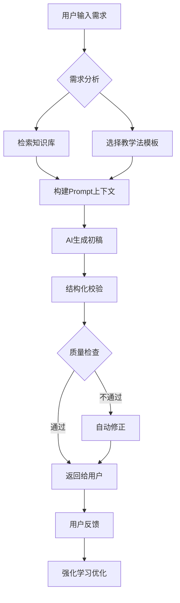

# AI备课助手 - 全套技术评估方案

## 📋 目录
1. [项目概述与技术架构](#1-项目概述与技术架构)
2. [AI技术方案详解](#2-ai技术方案详解)
3. [技术栈选型](#3-技术栈选型)
4. [系统架构设计](#4-系统架构设计)
5. [开发团队分工](#5-开发团队分工)
6. [开发周期与里程碑](#6-开发周期与里程碑)
7. [技术风险与应对](#7-技术风险与应对)
8. [成本预估](#8-成本预估)
9. [技术可行性结论](#9-技术可行性结论)

---

## 1. 项目概述与技术架构

### 1.1 核心功能模块

| 模块 | 功能描述 | 优先级 |
|------|----------|--------|
| **AI教案生成** | 基于输入参数自动生成结构化教案 | P0 |
| **用户系统** | 认证、权限、个人空间 | P0 |
| **课程管理** | CRUD、版本控制、协作 | P0 |
| **模板系统** | 教学法模板库、自定义模板 | P1 |
| **资源库** | 教案存储、检索、筛选、导出 | P1 |
| **实时协作** | 多人编辑、评论、分享 | P2 |

### 1.2 技术架构概览

```text
┌─────────────────────────────────────────────────────────┐ 
│                      前端层 (Frontend)                    │ 
│  React/Next.js + TypeScript + TailwindCSS + Zustand     │ 
└────────────────────┬────────────────────────────────────┘ 
                     │ REST API / WebSocket / GraphQL 
┌────────────────────┴────────────────────────────────────┐ 
│                    API网关层 (API Gateway)                │ 
│           Nginx + Rate Limiting + Authentication        │ 
└────────────────────┬────────────────────────────────────┘ 
                     │ 
        ┌────────────┼────────────┐ 
        │            │            │ 
┌───────┴──────┐ ──┴────────┐ ┌─┴──────────┐ 
│  业务服务层   │ │ AI服务层  │ │  文件服务   │ 
│  (Node.js)   │ │(Python)   │ │  (OSS/S3)  │ 
└───────┬──────┘ └───┬───────┘ └─┬──────────┘ 
        │            │           │ 
┌───────┴──────┐ ┌──┴────────┐ ┌─┴──────────┐ 
│   PostgreSQL │ │   Redis   │ │  MongoDB   │ 
│   (主数据库)  │ │  (缓存)   │ │ (文档存储)  │ 
└──────────────┘ └───────────┘ └────────────┘ 
```

---

## 2. AI技术方案详解

### 2.1 AI架构设计

#### **方案A：混合LLM架构（推荐）**

```python
# AI服务架构示例 
class LessonPlanAIService: 
    def __init__(self): 
        # 主模型：GPT-4/Claude 3 - 高质量生成 
        self.primary_model = OpenAI(model="gpt-4-turbo") 
        
        # 辅助模型：开源模型 - 成本优化 
        self.cost_effective_model = AzureOpenAI( 
            model="gpt-35-turbo" 
        ) 
        
        # 嵌入模型：文本向量化 
        self.embedding_model = OpenAIEmbeddings() 
        
        # RAG知识库 
        self.vector_store = PineconeClient() 
        
    async def generate_lesson_plan(self, requirements: LessonRequirements): 
        # 1. 检索相似教案（RAG） 
        similar_plans = await self.retrieve_similar_plans( 
            requirements.topic, 
            requirements.grade_level, 
            requirements.subject 
        ) 
        
        # 2. 构建Prompt上下文 
        context = self.build_context( 
            requirements, 
            similar_plans, 
            teaching_templates=requirements.template 
        ) 
        
        # 3. 生成分阶段教案 
        lesson_plan = await self.primary_model.generate( 
            prompt=self.SYSTEM_PROMPT, 
            context=context, 
            temperature=0.7, 
            max_tokens=4000 
        ) 
        
        # 4. 质量校验与结构化 
        validated_plan = await self.validate_and_structure(lesson_plan) 
        
        return validated_plan 
```

#### **核心技术点**

| 技术 | 用途 | 实现方案 |
|------|------|----------|
| **LLM大语言模型** | 教案内容生成 | GPT-4 Turbo / Claude 3 / 文心一言4.0 |
| **RAG检索增强** | 提升内容准确性 | Pinecone向量数据库 + 教学知识库 |
| **Prompt工程** | 控制输出质量 | Few-shot Learning + 结构化输出 |
| **微调模型** | 领域专业化 | Fine-tune Llama 3 on 教案数据集 |
| **多模态AI** | 图片/图表生成 | DALL-E 3 / Stable Diffusion |

### 2.2 AI生成流程



### 2.3 Prompt设计策略

```python
# 系统Prompt模板 
SYSTEM_PROMPT = """ 
你是一位资深教学设计师，擅长{subject}学科的教学设计。 

请根据以下要求生成一份专业的教案： 
- 适用年级：{grade_level} 
- 核心主题：{topic} 
- 教学时长：{duration}分钟 
- 教学法：{pedagogy_method} 
- 特殊要求：{special_requirements} 

输出格式必须严格遵循以下JSON结构： 
{ 
  "learning_objectives": ["目标1", "目标2"], 
  "key_concepts": ["概念1", "概念2"], 
  "teaching_process": [ 
    { 
      "stage": "导入", 
      "duration": 10, 
      "activities": ["活动描述"], 
      "teacher_actions": "教师行为", 
      "student_activities": "学生活动" 
    } 
  ], 
  "assessment": "评估方式", 
  "homework": "作业设计", 
  "materials": ["所需材料"] 
} 

请确保内容符合{curriculum_standard}课程标准。 
""" 

# Few-shot示例 
FEW_SHOT_EXAMPLES = [ 
    { 
        "input": {"subject": "数学", "topic": "勾股定理", "grade": "八年级"}, 
        "output": { 
            "learning_objectives": [ 
                "学生能够陈述勾股定理公式（a² + b² = c²）", 
                "学生能够运用定理解决实际问题" 
            ], 
            # ... 完整示例 
        } 
    } 
] 
```

### 2.4 AI成本优化策略

| 策略 | 说明 | 预期节省 |
|------|------|----------|
| **模型分级** | 简单任务用GPT-3.5，复杂任务用GPT-4 | 40-60% |
| **结果缓存** | 相同需求直接返回缓存结果 | 30-50% |
| **流式输出** | 减少等待时间，提升体验 | - |
| **批量处理** | 合并多个请求 | 20-30% |
| **本地模型** | 非核心功能用开源模型 | 70-90% |

**预估成本**（按1000活跃教师/月）：
- GPT-4 Turbo：约 $2,000-3,000/月
- GPT-3.5 Turbo：约 $500-800/月
- 向量数据库（Pinecone）：约 $100-200/月
- **总计：$2,600-4,000/月**

---

## 3. 技术栈选型

### 3.1 前端技术栈

#### **核心框架**
```json
{ 
  "framework": "Next.js 14 (App Router)", 
  "language": "TypeScript 5.x", 
  "styling": "TailwindCSS 3.x + CSS Modules", 
  "state_management": "Zustand + React Query", 
  "ui_components": "shadcn/ui + Radix UI", 
  "forms": "React Hook Form + Zod", 
  "charts": "Recharts / Chart.js", 
  "rich_text": "TipTap / Quill", 
  "file_upload": "React Dropzone + Uppy", 
  "real_time": "Socket.io Client" 
} 
```

#### **前端架构亮点**
- ✅ **SSR/SSG**：Next.js 14 App Router，提升SEO和首屏速度
- ✅ **组件库**：基于shadcn/ui定制，符合Design System
- ✅ **国际化**：i18next（支持中英双语）
- ✅ **性能优化**：懒加载、代码分割、图片优化
- ✅ **PWA支持**：离线访问、桌面安装

### 3.2 后端技术栈

#### **方案A：Node.js全栈（推荐）**
```javascript
// 技术栈配置 
{ 
  runtime: "Node.js 20 LTS", 
  framework: "NestJS 10.x",  // 企业级框架 
  api_spec: "OpenAPI 3.0 (Swagger)", 
  authentication: "JWT + Passport", 
  validation: "class-validator", 
  orm: "Prisma ORM", 
  cache: "Redis + ioredis", 
  queue: "BullMQ (任务队列)", 
  file_storage: "AWS S3 / 阿里云OSS", 
  search: "Elasticsearch / Algolia", 
  websocket: "Socket.io" 
} 
```

#### **方案B：Python混合（AI重度场景）**
```yaml
# 后端服务拆分 
services: 
  api_gateway: 
    tech: "FastAPI" 
    purpose: "REST API + 业务逻辑" 
    
  ai_service: 
    tech: "FastAPI + LangChain" 
    purpose: "AI生成、RAG、微调" 
    
  worker_service: 
    tech: "Celery + Redis" 
    purpose: "异步任务处理" 
```

### 3.3 数据库设计

#### **主数据库：PostgreSQL 15+**
```sql
-- 核心表结构示例 

-- 用户表 
CREATE TABLE users ( 
    id UUID PRIMARY KEY DEFAULT gen_random_uuid(), 
    email VARCHAR(255) UNIQUE NOT NULL, 
    name VARCHAR(100), 
    role VARCHAR(50) DEFAULT 'teacher', -- teacher, admin, collaborator 
    school_info JSONB, 
    subscription_tier VARCHAR(50) DEFAULT 'free', 
    created_at TIMESTAMP DEFAULT NOW(), 
    updated_at TIMESTAMP DEFAULT NOW() 
); 

-- 教案表 
CREATE TABLE lesson_plans ( 
    id UUID PRIMARY KEY DEFAULT gen_random_uuid(), 
    user_id UUID REFERENCES users(id), 
    title VARCHAR(255) NOT NULL, 
    subject VARCHAR(100), 
    grade_level VARCHAR(50), 
    topic VARCHAR(255), 
    duration_minutes INTEGER, 
    pedagogy_method VARCHAR(100), 
    content JSONB NOT NULL, -- 结构化教案内容 
    status VARCHAR(50) DEFAULT 'draft', -- draft, published, archived 
    version INTEGER DEFAULT 1, 
    parent_id UUID REFERENCES lesson_plans(id), -- 版本控制 
    ai_model_used VARCHAR(100), 
    created_at TIMESTAMP DEFAULT NOW(), 
    updated_at TIMESTAMP DEFAULT NOW(), 
    
    INDEX idx_user_subject (user_id, subject), 
    INDEX idx_grade_topic (grade_level, topic) 
); 

-- 模板表 
CREATE TABLE templates ( 
    id UUID PRIMARY KEY DEFAULT gen_random_uuid(), 
    name VARCHAR(255) NOT NULL, 
    description TEXT, 
    category VARCHAR(100), -- 5E, PBL, 翻转课堂 
    subject_tags TEXT[], 
    structure_schema JSONB, -- 模板结构定义 
    example_content JSONB, 
    is_public BOOLEAN DEFAULT false, 
    created_by UUID REFERENCES users(id), 
    usage_count INTEGER DEFAULT 0, 
    created_at TIMESTAMP DEFAULT NOW() 
); 

-- 资源库表 
CREATE TABLE resources ( 
    id UUID PRIMARY KEY DEFAULT gen_random_uuid(), 
    lesson_plan_id UUID REFERENCES lesson_plans(id), 
    resource_type VARCHAR(50), -- pdf, image, video, link 
    title VARCHAR(255), 
    url TEXT, 
    file_size BIGINT, 
    metadata JSONB, 
    created_at TIMESTAMP DEFAULT NOW() 
); 

-- AI生成记录表（用于分析和优化） 
CREATE TABLE ai_generation_logs ( 
    id UUID PRIMARY KEY DEFAULT gen_random_uuid(), 
    user_id UUID REFERENCES users(id), 
    prompt TEXT, 
    model_used VARCHAR(100), 
    tokens_used INTEGER, 
    generation_time_ms INTEGER, 
    user_feedback INTEGER, -- 1-5评分 
    created_at TIMESTAMP DEFAULT NOW() 
); 
```

#### **辅助数据库**

| 数据库 | 用途 | 选型 |
|--------|------|------|
| **Redis** | 缓存、Session、实时消息 | Redis 7.x + RedisJSON |
| **MongoDB** | 非结构化数据、日志 | MongoDB 6.x |
| **Pinecone** | 向量数据库（RAG） | Pinecone / Weaviate |
| **Elasticsearch**| 全文搜索 | ES 8.x / Meilisearch |

### 3.4 基础设施

#### **云服务选型**

| 服务 | 推荐方案 | 备选方案 |
|------|----------|----------|
| **云服务商** | 阿里云 / 腾讯云 | AWS / Azure |
| **容器编排** | Kubernetes (ACK/TKE) | Docker Swarm |
| **CI/CD** | GitHub Actions + ArgoCD | GitLab CI |
| **监控** | Prometheus + Grafana | Datadog |
| **日志** | ELK Stack | Loki + Grafana |
| **CDN** | 阿里云CDN | Cloudflare |
| **对象存储** | 阿里云OSS | AWS S3 |

#### **部署架构**
```yaml
# Kubernetes部署示例 
apiVersion: apps/v1 
kind: Deployment 
metadata: 
  name: lesson-planner-api 
spec: 
  replicas: 3 
  selector: 
    matchLabels: 
      app: lesson-planner-api 
  template: 
    metadata: 
      labels: 
        app: lesson-planner-api 
    spec: 
      containers: 
      - name: api 
        image: registry.cn-hangzhou.aliyuncs.com/lesson-planner/api:latest 
        ports: 
        - containerPort: 3000 
        env: 
        - name: NODE_ENV 
          value: "production" 
        - name: DATABASE_URL 
          valueFrom: 
            secretKeyRef: 
              name: db-secret 
              key: url 
        resources: 
          requests: 
            memory: "512Mi" 
            cpu: "500m" 
          limits: 
            memory: "1Gi" 
            cpu: "1000m" 
        livenessProbe: 
          httpGet: 
            path: /health 
            port: 3000 
          initialDelaySeconds: 30 
          periodSeconds: 10 
--- 
apiVersion: v1 
kind: Service 
metadata: 
  name: lesson-planner-api-service 
spec: 
  selector: 
    app: lesson-planner-api 
  ports: 
  - protocol: TCP 
    port: 80 
    targetPort: 3000 
  type: ClusterIP 
```

---

## 4. 系统架构设计

### 4.1 微服务拆分

```text
┌─────────────────────────────────────────────────────────────┐ 
│                        API Gateway (Nginx)                   │ 
│                   Rate Limiting + SSL Termination            │ 
└────────────┬────────────────────────────────────┬───────────┘ 
             │                                    │ 
    ┌────────┴─────────┐              ┌─────────┴──────────┐ 
    │   用户服务        │              │    课程服务         │ 
    │  - 认证授权      │              │  - 教案CRUD         │ 
    │  - 个人信息      │              │  - 版本控制         │ 
    │  - 订阅管理      │              │  - 搜索筛选         │ 
    └──────────────────┘              └────────────────────┘ 
             │                                    │ 
    ┌─────────────────┐              ┌─────────┴──────────┐ 
    │   模板服务        │              │    AI生成服务       │ 
    │  - 模板管理      │              │  - LLM调用          │ 
    │  - 分类检索      │              │  - Prompt管理       │ 
    │  - 使用统计      │              │  - RAG检索          │ 
    └──────────────────┘              │  - 质量校验         │ 
                                      └────────────────────┘ 
             │                                    │ 
    ┌─────────────────┐              ┌─────────┴──────────┐ 
    │   资源服务        │              │    协作服务         │ 
    │  - 文件上传      │              │  - 实时编辑         │ 
    │  - CDN分发       │              │  - 评论批注         │ 
    │  - 格式转换      │              │  - 分享权限         │ 
    └──────────────────┘              └────────────────────┘ 
```

### 4.2 核心API设计

#### **RESTful API规范**
```typescript
// API路由设计 
const API_ROUTES = { 
  // 认证 
  auth: { 
    login: 'POST /api/v1/auth/login', 
    register: 'POST /api/v1/auth/register', 
    refresh: 'POST /api/v1/auth/refresh', 
  }, 
  
  // 教案 
  lessons: { 
    list: 'GET /api/v1/lessons', 
    create: 'POST /api/v1/lessons', 
    get: 'GET /api/v1/lessons/:id', 
    update: 'PATCH /api/v1/lessons/:id', 
    delete: 'DELETE /api/v1/lessons/:id', 
    duplicate: 'POST /api/v1/lessons/:id/duplicate', 
    export: 'GET /api/v1/lessons/:id/export', 
  }, 
  
  // AI生成 
  ai: { 
    generate: 'POST /api/v1/ai/generate', 
    refine: 'POST /api/v1/ai/refine', 
    suggest: 'GET /api/v1/ai/suggestions', 
  }, 
  
  // 模板 
  templates: { 
    list: 'GET /api/v1/templates', 
    get: 'GET /api/v1/templates/:id', 
    use: 'POST /api/v1/templates/:id/use', 
  }, 
  
  // 资源库 
  resources: { 
    upload: 'POST /api/v1/resources/upload', 
    list: 'GET /api/v1/resources', 
    delete: 'DELETE /api/v1/resources/:id', 
  }, 
} 

// 请求/响应示例 
interface LessonPlanRequest { 
  title: string; 
  subject: string; 
  gradeLevel: string; 
  topic: string; 
  duration: number; 
  pedagogyMethod?: string; 
  specialRequirements?: string; 
  templateId?: string; 
} 

interface LessonPlanResponse { 
  id: string; 
  title: string; 
  content: { 
    learningObjectives: string[]; 
    keyConcepts: string[]; 
    teachingProcess: TeachingStage[]; 
    assessment: string; 
    homework: string; 
    materials: string[]; 
  }; 
  metadata: { 
    aiModel: string; 
    generationTime: number; 
    version: number; 
  }; 
} 
```

### 4.3 实时协作架构

```typescript
// WebSocket实时协作实现 
import { Server } from 'socket.io'; 
import { RedisAdapter } from '@socket.io/redis-adapter'; 

export class CollaborationService { 
  private io: Server; 
  
  constructor() { 
    this.io = new Server({ 
      adapter: RedisAdapter, 
      cors: { origin: process.env.FRONTEND_URL } 
    }); 
    
    this.setupHandlers(); 
  } 
  
  private setupHandlers() { 
    this.io.on('connection', (socket) => { 
      // 加入教案房间 
      socket.on('join-lesson', (lessonId: string) => { 
        socket.join(`lesson:${lessonId}`); 
      }); 
      
      // 实时编辑同步 
      socket.on('content-change', (data: { 
        lessonId: string; 
        userId: string; 
        changes: any; 
      }) => { 
        socket.to(`lesson:${data.lessonId}`).emit('remote-change', data); 
        // 保存到数据库（防抖） 
        this.debounceSave(data); 
      }); 
      
      // 光标位置同步 
      socket.on('cursor-move', (data) => { 
        socket.to(`lesson:${data.lessonId}`).emit('remote-cursor', { 
          userId: data.userId, 
          position: data.position 
        }); 
      }); 
      
      // 评论和批注 
      socket.on('add-comment', (data) => { 
        this.io.to(`lesson:${data.lessonId}`).emit('new-comment', data); 
      }); 
    }); 
  } 
} 
```

---

## 5. 开发团队分工

### 5.1 团队组织架构

```text
项目团队（8-10人） 
│ 
├── 技术负责人 (Tech Lead) - 1人 
│   ├── 技术架构设计 
│   ├── 代码审查 
│   └── 技术决策 
│ 
├── 前端开发组 - 3人 
│   ├── 前端负责人 (Senior) 
│   │   ├── 核心架构搭建 
│   │   ├── 组件库开发 
│   │   └── 性能优化 
│   │ 
│   ├── 前端开发 (Mid-level) 
│   │   ├── 页面开发 
│   │   ├── 状态管理 
│   │   └── API集成 
│   │ 
│   └── 前端开发 (Junior) 
│       ├── UI组件实现 
│       ├── 响应式适配 
│       └── 单元测试 
│ 
├── 后端开发组 - 3人 
│   ├── 后端负责人 (Senior) 
│   │   ├── API设计 
│   │   ├── 数据库设计 
│   │   └── 安全认证 
│   │ 
│   ├── 后端开发 (Mid-level) 
│   │   ├── 业务逻辑实现 
│   │   ├── 微服务开发 
│   │   └── 集成测试 
│   │ 
│   └── AI工程师 (Specialist) 
│       ├── LLM集成 
│       ├── Prompt工程 
│       ├── RAG系统 
│       └── 模型优化 
│ 
├── DevOps工程师 - 1人 
│   ├── CI/CD流水线 
│   ├── 容器化部署 
│   ├── 监控告警 
│   └── 性能调优 
│ 
└── QA测试 - 1-2人 
    ├── 测试用例设计 
    ├── 自动化测试 
    └── 性能测试 
```

### 5.2 详细职责分工

#### **阶段一：MVP开发（Week 1-6）**

| 角色 | 任务 | 交付物 |
|------|------|--------|
| **Tech Lead** | 架构设计、技术选型、代码规范制定 | 技术文档、项目脚手架 |
| **前端负责人** | 设计系统实现、核心组件库、路由架构 | UI组件库、页面框架 |
| **前端开发1** | AI备课中心页面、实时预览功能 | 完整的编辑器界面 |
| **前端开发2** | 工作台首页、资源库页面 | 仪表盘、列表页 |
| **后端负责人** | 数据库设计、用户认证、API网关 | 用户系统、基础API |
| **后端开发** | 教案CRUD、文件上传、搜索功能 | 课程管理API |
| **AI工程师** | LLM集成、Prompt设计、生成流程 | AI生成服务 |
| **DevOps** | Docker化、CI/CD、测试环境 | 自动化部署流程 |

#### **阶段二：功能完善（Week 7-12）**

| 角色 | 任务 | 交付物 |
|------|------|--------|
| **前端团队** | 模板广场、协作编辑、导出功能 | 完整功能模块 |
| **后端团队** | 模板系统、版本控制、权限管理 | 高级功能API |
| **AI工程师** | RAG系统、质量校验、成本优化 | AI优化方案 |
| **QA** | 端到端测试、性能测试 | 测试报告 |

### 5.3 开发工具与协作

```yaml
项目管理: 
  - Jira / 禅道：任务跟踪 
  - Confluence / 语雀：文档管理 
  - Figma：UI设计协作 
  
代码管理: 
  - Git：版本控制 
  - GitHub / GitLab：代码托管 
  - Git Flow：分支策略 
  
开发环境: 
  - VS Code + Extensions：编辑器 
  - Docker Desktop：本地容器 
  - Postman / Insomnia：API测试 
  
代码质量: 
  - ESLint + Prettier：代码规范 
  - Jest + React Testing Library：单元测试 
  - SonarQube：代码质量扫描 
  
沟通协作: 
  - Slack / 钉钉：即时通讯 
  - Zoom / 腾讯会议：每日站会 
  - Notion：知识库 
```

---

## 6. 开发周期与里程碑

### 6.1 总体时间规划

```text
┌─────────────────────────────────────────────────────────────┐ 
│                    项目总周期：16周                          │ 
├─────────────┬─────────────┬─────────────┬─────────────────┤ 
│   Phase 1   │   Phase 2   │   Phase 3   │    Phase 4      │ 
│   MVP开发   │  功能完善   │  优化测试   │    上线运维     │ 
│  (6周)      │  (6周)      │  (3周)      │    (1周+)       │ 
└─────────────┴─────────────┴─────────────┴─────────────────┘ 
```

### 6.2 详细里程碑

#### **Phase 1：MVP开发（Week 1-6）**
**Week 1-2：基础架构**
- [ ] 项目脚手架搭建
- [ ] 数据库设计与初始化
- [ ] 用户认证系统
- [ ] 设计系统实现
- [ ] CI/CD流程配置

**Week 3-4：核心功能**
- [ ] AI备课中心前端页面
- [ ] 教案CRUD API
- [ ] LLM集成与Prompt调试
- [ ] 基础文件上传

**Week 5-6：MVP集成**
- [ ] 工作台首页
- [ ] AI生成流程联调
- [ ] 基础搜索功能
- [ ] MVP内部测试

**🎯 里程碑1：可演示的MVP**
- 用户可以登录系统
- 可以输入需求并生成教案
- 可以查看和编辑教案

---

#### **Phase 2：功能完善（Week 7-12）**
**Week 7-8：模板系统**
- [ ] 教学模板广场
- [ ] 模板管理后端
- [ ] 模板使用流程

**Week 9-10：资源库**
- [ ] 教案资源库页面
- [ ] 高级筛选功能
- [ ] 导出PDF/Word
- [ ] 批量操作

**Week 11-12：协作功能**
- [ ] 实时协作编辑
- [ ] 评论和批注
- [ ] 分享与权限
- [ ] 版本历史

**🎯 里程碑2：功能完整版**
- 所有核心功能可用
- 可以进行Beta测试

---

#### **Phase 3：优化测试（Week 13-15）**
**Week 13：性能优化**
- [ ] 前端性能优化（懒加载、缓存）
- [ ] 数据库查询优化
- [ ] AI响应速度优化
- [ ] CDN配置

**Week 14：测试修复**
- [ ] 端到端测试
- [ ] 压力测试
- [ ] 安全审计
- [ ] Bug修复

**Week 15：用户体验**
- [ ] UI细节优化
- [ ] 交互体验提升
- [ ] 文档编写
- [ ] 用户培训材料

**🎯 里程碑3：生产就绪**
- 通过所有测试
- 性能达标
- 文档完整

---

#### **Phase 4：上线运维（Week 16+）**
**Week 16：上线部署**
- [ ] 生产环境部署
- [ ] 域名配置与SSL
- [ ] 监控告警配置
- [ ] 灰度发布

**上线后：持续运维**
- [ ] 用户反馈收集
- [ ] Bug修复与迭代
- [ ] 性能监控
- [ ] 成本优化

**🎯 里程碑4：正式上线**

---

### 6.3 关键路径分析

```text
关键路径任务： 
1. 数据库设计 → 2. 用户认证 → 3. AI集成 → 4. 教案生成 → 5. 前端联调 → 6. 测试优化 

风险缓冲： 
- AI集成：预留2周缓冲（模型调试、效果优化） 
- 性能优化：预留1周缓冲 
- Bug修复：预留1周缓冲 
```

---

## 7. 技术风险与应对

### 7.1 技术风险评估

| 风险项 | 可能性 | 影响程度 | 应对策略 |
|--------|--------|----------|----------|
| **AI生成质量不稳定** | 高 | 高 | 多模型备选、人工审核流程、持续优化Prompt |
| **API成本超支** | 中 | 高 | 缓存策略、模型分级、限流机制 |
| **并发性能不足** | 中 | 中 | 负载均衡、数据库读写分离、CDN |
| **数据安全问题** | 低 | 高 | 加密存储、访问控制、审计日志 |
| **实时协作延迟** | 中 | 中 | WebSocket优化、操作转换算法(OT) |
| **浏览器兼容性** | 低 | 低 | 渐进增强、Polyfill |

### 7.2 详细应对方案

#### **风险1：AI生成质量不稳定**

**问题表现：**
- 生成内容不符合教学标准
- 格式混乱或结构错误
- 知识点错误

**解决方案：**
```python
class QualityControlService: 
    def validate_lesson_plan(self, plan: LessonPlan) -> ValidationResult: 
        checks = [ 
            self.check_structure_completeness, 
            self.check_learning_objectives_quality, 
            self.check_time_allocation, 
            self.check_curriculum_alignment, 
        ] 
        
        results = [check(plan) for check in checks] 
        
        if any(r.score < 0.7 for r in results): 
            # 自动修正 
            return self.auto_refine(plan) 
        
        return ValidationResult(passed=True, score=sum(r.score)/len(results)) 
    
    def auto_refine(self, plan: LessonPlan) -> LessonPlan: 
        # 使用更强大的模型进行修正 
        refined = self.llm.refine( 
            original=plan, 
            feedback=self.get_validation_feedback(plan) 
        ) 
        return refined 
```

**预防措施：**
- 建立教案质量评估标准
- 收集用户反馈持续优化
- 建立教学专家审核机制

---

#### **风险2：API成本超支**

**问题表现：**
- 月度AI费用超出预算
- 高并发时成本激增

**解决方案：**
```typescript
// 成本优化策略实现 
class CostOptimizationService { 
  // 1. 智能缓存 
  async generateWithCache(request: GenerationRequest): Promise<LessonPlan> { 
    const cacheKey = this.generateCacheKey(request); 
    
    // 检查缓存 
    const cached = await redis.get(cacheKey); 
    if (cached) { 
      return cached; 
    } 
    
    // 生成并缓存 
    const result = await this.aiService.generate(request); 
    await redis.setex(cacheKey, 86400 * 7, result); // 缓存7天 
    
    return result; 
  } 
  
  // 2. 模型分级 
  selectModel(request: GenerationRequest): string { 
    if (request.priority === 'high' || request.complexity > 0.8) { 
      return 'gpt-4-turbo'; // 高质量 
    } else if (request.userTier === 'premium') { 
      return 'gpt-4-turbo'; 
    } else { 
      return 'gpt-3.5-turbo'; // 成本优化 
    } 
  } 
  
  // 3. 限流控制 
  async checkRateLimit(userId: string): Promise<boolean> { 
    const key = `rate_limit:${userId}:${Date.now() / 3600000}`; 
    const count = await redis.incr(key); 
    await redis.expire(key, 3600); 
    
    if (count > this.getUserLimit(userId)) { 
      throw new RateLimitError('生成次数超限，请升级套餐'); 
    } 
    
    return true; 
  } 
} 
```

**监控告警：**
```yaml
# Prometheus告警规则 
groups: 
  - name: ai_cost_alerts 
    rules: 
      - alert: HighAICost 
        expr: sum(ai_api_cost_total) > 3000 
        for: 1h 
        labels: 
          severity: warning 
        annotations: 
          summary: "AI API成本超过$3000" 
          
      - alert: HighTokenUsage 
        expr: rate(ai_tokens_total[1h]) > 1000000 
        for: 30m 
        labels: 
          severity: critical 
        annotations: 
          summary: "Token使用量异常" 
```

---

#### **风险3：并发性能不足**

**问题表现：**
- 高峰期响应缓慢
- 数据库连接池耗尽

**解决方案：**

**数据库优化：**
```sql
-- 1. 索引优化 
CREATE INDEX idx_lessons_user_subject ON lesson_plans(user_id, subject); 
CREATE INDEX idx_lessons_created_at ON lesson_plans(created_at DESC); 
CREATE INDEX idx_lessons_fulltext ON lesson_plans USING GIN(to_tsvector('chinese', title || ' ' || topic)); 

-- 2. 读写分离 
-- 主库：写操作 
-- 从库：读操作（教案查询、搜索） 

-- 3. 分区表（按月） 
CREATE TABLE lesson_plans_2024_01 PARTITION OF lesson_plans 
    FOR VALUES FROM ('2024-01-01') TO ('2024-02-01'); 
```

**缓存策略：**
```typescript
// 多级缓存架构 
class MultiLevelCache { 
  // L1: 内存缓存（最快） 
  private memoryCache = new Map<string, any>(); 
  
  // L2: Redis缓存（分布式） 
  private redisClient: Redis; 
  
  // L3: 数据库（持久化） 
  
  async get(key: string): Promise<any> { 
    // 检查L1 
    if (this.memoryCache.has(key)) { 
      return this.memoryCache.get(key); 
    } 
    
    // 检查L2 
    const redisData = await this.redisClient.get(key); 
    if (redisData) { 
      const parsed = JSON.parse(redisData); 
      this.memoryCache.set(key, parsed); // 回填L1 
      return parsed; 
    } 
    
    return null; 
  } 
  
  async set(key: string, value: any, ttl: number = 3600): Promise<void> { 
    this.memoryCache.set(key, value); 
    await this.redisClient.setex(key, ttl, JSON.stringify(value)); 
  } 
} 
```

**负载均衡配置：**
```nginx
# Nginx负载均衡 
upstream lesson_planner_backend { 
    least_conn; 
    server backend1:3000 weight=3; 
    server backend2:3000 weight=3; 
    server backend3:3000 weight=2 backup; 
    keepalive 32; 
} 

server { 
    listen 443 ssl; 
    
    location /api/ { 
        proxy_pass http://lesson_planner_backend; 
        proxy_http_version 1.1; 
        proxy_set_header Connection ""; 
        
        # 限流 
        limit_req zone=api_limit burst=20 nodelay; 
        
        # 超时设置 
        proxy_connect_timeout 60s; 
        proxy_send_timeout 60s; 
        proxy_read_timeout 60s; 
    } 
} 

# 限流区域 
limit_req_zone $binary_remote_addr zone=api_limit:10m rate=10r/s; 
```

---

### 7.3 监控与告警体系

```yaml
监控指标: 
  应用层: 
    - API响应时间 (P95 < 500ms) 
    - 错误率 (< 1%) 
    - QPS (监控峰值) 
    - AI生成成功率 
    
  系统层: 
    - CPU使用率 (< 70%) 
    - 内存使用率 (< 80%) 
    - 磁盘使用率 (< 75%) 
    - 网络IO 
    
  业务层: 
    - 日活跃用户 
    - 教案生成次数 
    - AI API成本 
    - 用户满意度评分 

告警渠道: 
  - 邮件：非紧急告警 
  - 钉钉/企业微信：紧急告警 
  - 电话：严重故障（P0） 
```

---

## 8. 成本预估

### 8.1 开发成本

| 项目 | 人员 | 周期 | 成本（人民币） |
|------|------|------|----------------|
| 技术负责人 | 1人 | 16周 | ¥320,000 |
| 前端开发 | 3人 | 16周 | ¥480,000 |
| 后端开发 | 2人 | 16周 | ¥320,000 |
| AI工程师 | 1人 | 16周 | ¥200,000 |
| DevOps | 1人 | 12周 | ¥120,000 |
| QA测试 | 1人 | 8周 | ¥64,000 |
| **合计** | - | - | **¥1,504,000** |

### 8.2 基础设施成本（月度）

| 服务 | 规格 | 月成本（元） |
|------|------|--------------|
| 云服务器（K8s集群） | 8核32G × 3 | ¥3,000 |
| 数据库（PostgreSQL） | 4核16G 高可用 | ¥1,500 |
| Redis缓存 | 2核8G | ¥500 |
| 对象存储OSS | 100GB + 流量 | ¥300 |
| CDN | 500GB流量 | ¥200 |
| AI API（GPT-4 + GPT-3.5） | 预估1000用户 | ¥15,000 |
| 监控与日志 | ELK + Prometheus | ¥500 |
| **合计** | - | **¥21,000/月** |

### 8.3 总体投资

- **开发成本**：¥150万（一次性）
- **运营成本**：¥25万/年
- **首年总成本**：¥175万

---

## 9. 技术可行性结论

### ✅ 技术可行性：**高**

**优势：**
1. **成熟技术栈**：所有技术均为业界成熟方案，有大量成功案例
2. **AI能力成熟**：GPT-4等模型已能生成高质量教案
3. **开发团队要求适中**：无需特殊技能，常规全栈团队即可
4. **云服务完善**：国内云服务商提供完整基础设施

**关键成功因素：**
1. **Prompt工程质量**：需要教学专家参与优化
2. **用户体验设计**：降低教师使用门槛
3. **成本控制**：合理的定价策略和成本优化
4. **持续迭代**：基于用户反馈快速优化

### 🎯 建议

**短期（MVP阶段）：**
- 聚焦核心功能：AI生成 + 基础编辑
- 快速验证市场需求
- 收集用户反馈

**中期（3-6个月）：**
- 完善协作功能
- 建立模板生态
- 优化AI生成质量

**长期（6-12个月）：**
- 引入更多AI能力（自动评估、个性化推荐）
- 建立教师社区
- 拓展至K12全学科
